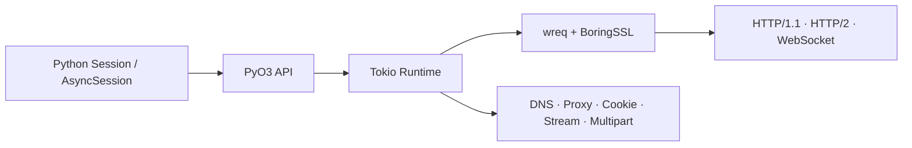

# requests-rs

<p align="center">
  <strong>Python 的浏览器网络指纹客户端，核心网络路径由 Rust 执行。</strong>
</p>

<p align="center">
  <a href="https://github.com/zt1901/requests_rust-source/actions/workflows/build-wheels.yml"></a>
  
  
  
  
</p>

`requests-rs` 为 Python 提供接近 `requests` 使用习惯的同步和原生异步 API。唯一公开入口是 `from requests_rs import requests`。HTTP/1.1、HTTP/2、TLS 浏览器画像、代理和 WebSocket 由 wreq、BoringSSL 与 Tokio 执行。schema 2 指纹包含完整 QUIC/H3 模板时，`http3` 会真实回放该模板；schema 1 或代理场景自动使用 H2/H1.1。

**HTTP/3 兼容性边界：** 接收端已实现动态 QPACK 表、增量编码器指令、阻塞头块恢复及 ACK／取消反馈；发送端仍使用合法的静态／字面量编码。捕获的 SETTINGS 按模板发送，不会偷偷降低容量改变指纹；本地另有阻塞缓冲和反馈队列资源上限，超限会明确失败。该实现仍需持续进行独立服务端互操作验证，不能视为完整浏览器 H3 行为保证。请求已经发出后的失败不会自动重试，以避免重复执行有副作用的操作。

适合需要长期 Session、真实连接复用、代理身份隔离和可审计浏览器传输画像的采集、自动化与网络研究项目。

## 为什么使用

- **网络路径在 Rust**：DNS、连接池、TLS、HTTP、代理、Cookie、流、multipart 和 WebSocket 不依赖 Python 工作线程。
- **真实浏览器采集画像**：profile 来自浏览器 TLS/HTTP2 线级记录，不靠修改 UA 冒充版本。
- **自定义指纹零全局污染**：每个 `Session` 可以直接加载自己的单 profile JSON，不修改进程全局配置。
- **同步与 asyncio 同一语义**：`Session`、`AsyncSession`、模块级方法、响应对象和错误边界保持一致。
- **统一连接上限**：HTTP、代理、流和 WebSocket 共用 Rust `Semaphore`，不会各自突破 Session 上限。
- **连接身份隔离**：Origin、完整代理身份、DNS配置和指纹变体共同决定可复用链路。

## 快速开始

### 1. 安装 wheel

项目发布 wheel 后，从 [GitHub Releases](https://github.com/zt1901/requests_rust-source/releases) 下载与系统和 CPU 匹配的文件：

```bash
python -m pip install requests_rs-0.4.0-cp310-abi3-win_amd64.whl
```

当前 wheel 使用 CPython stable ABI，支持 CPython 3.10 及以上版本。仓库尚未发布对应 Release 时，可按下方“从源码构建”操作。

### 2. 发起请求

```python
from requests_rs import requests

with requests.Session(impersonate="edge152", timeout=30) as 会话:
    响应 = 会话.get(
        "https://example.com/",
        headers={"accept": "text/html,application/xhtml+xml"},
    )
    响应.raise_for_status()
    print(响应.status_code)
    print(响应.http_version)
    print(响应.fingerprint_id)
```

### 3. 原生异步并发

```python
import asyncio
from requests_rs import requests


async def 异步主程序() -> None:
    目标地址列表 = [f"https://example.com/?task={序号}" for 序号 in range(10)]
    async with requests.AsyncSession(
        impersonate="edge152",
        max_connections=10,
    ) as 会话:
        响应列表 = await asyncio.gather(*(会话.get(地址) for 地址 in 目标地址列表))
    print([响应.status_code for 响应 in 响应列表])


asyncio.run(异步主程序())
```

仓库内还有可右键运行的完整示例：

- [`examples/basic_sync.py`](examples/basic_sync.py)：同步请求与响应字段。
- [`examples/async_concurrency.py`](examples/async_concurrency.py)：复用一个 `AsyncSession` 并发请求。
- [`examples/custom_fingerprint.py`](examples/custom_fingerprint.py)：直接加载捕获器 JSON 并保留浏览器 Header 顺序。

## 加载捕获器指纹

新版捕获器只输出一种完整 JSON：`{"schema_version": 2, "records": [...]}`；MCP `read_fingerprint_result` 返回同样包含 `schema_version` 和 `records` 的分页结果。无需分别准备 H2/H3 文件。旧裸记录数组仅为本库历史加载兼容，不是新版捕获器的输出选项。单一`profile`的文件路径、记录列表或MCP结果对象都可以直接作为`impersonate`传入，不需要手动落盘或重写JSON：

```python
from pathlib import Path
from requests_rs import requests

指纹文件 = Path(r"C:\fingerprints\edge152.json")

浏览器请求头 = [
    ("upgrade-insecure-requests", "1"),
    ("accept", "text/html,application/xhtml+xml,application/xml;q=0.9,*/*;q=0.8"),
    ("sec-fetch-site", "none"),
    ("sec-fetch-mode", "navigate"),
    ("sec-fetch-user", "?1"),
    ("sec-fetch-dest", "document"),
]

with requests.Session(
    impersonate=指纹文件,
    fingerprint_rotation=False,
    headers=浏览器请求头,
) as 会话:
    响应 = 会话.get("https://example.com/")
    print(会话.fingerprint_count)
    print(响应.fingerprint_id)
```

MCP对象直传：

```python
# 捕获结果是MCP客户端调用read_fingerprint_result后得到的dict。
捕获结果 = await mcp_client.call_tool(
    "read_fingerprint_result",
    {"task_id": 任务ID},
)

记录 = 捕获结果["records"][0]
with Session(
    impersonate=捕获结果,
    fingerprint_rotation=False,
) as 会话:
    响应 = 会话.get(
        "https://example.com/",
        # JSON二维list会自动规范化并保持捕获顺序；值是否适合目标业务由调用方决定。
        headers=记录["http"]["headers"],
    )
```

已验证的加载契约：

- 单 profile 文件允许包含一个或多个变体。
- Session 自动识别 profile 名称。
- `response.fingerprint_id`只在所选模板确实应用到实际传输时返回源记录 ID。
- 文件只属于当前实例，不进入内置指纹全局缓存。
- `fingerprints_path=` 仍可用于从多 profile 文件中显式选择名称。
- 裸记录数组、Python记录序列和捕获器MCP的完整`{schema_version, records, ...}` dict envelope都可直接加载；未知schema、未知非GREASE TLS/H2 ID、损坏的扩展payload或顺序冲突会在Session构造期失败。
- 2026-09-02真实Chrome 152闭环验证：MCP形状对象直传后，源/回放ClientHello均为1914字节，JA4均为`t13i1516h2_8daaf6152771_cb7bf5808d99`，`0xca34` payload 206字节完全一致，HTTP/2 SETTINGS、优先级和Akamai参数一致。

业务 Cookie、认证、CSRF、签名、时间戳和 nonce 不应写入指纹文件。它们属于当前请求或账号状态，应通过 `headers=`、`cookies=`、`data=` 或 `json=` 传入。

## 架构



`http_version="http2"`默认按HTTP/2 → HTTP/1.1协商。`http_version="http3"`在直连 HTTPS 且所选指纹为 schema 2 时，按模板应用 BoringSSL ClientHello、QUIC Transport Parameters、HTTP/3 SETTINGS、Header 顺序与 QPACK 策略；失败再降级 H2/H1.1。schema 1、普通 HTTP/SOCKS 代理、multipart 和传输统计场景直接使用 H2/H1.1，不会以半指纹 H3 冒充成功。

## Profile 状态

profile名称是已采集并验证的快照，不是自动指向官网最新版的别名。

| Profile | 来源 | 状态 |
|---|---|---|
| `chrome146` | Google Chrome 历史采集 | 已验证固定快照 |
| `chrome150` | Google Chrome 历史采集 | 已验证固定快照 |
| `chrome152` | Google Chrome `152.0.7977.64`官方正式版 | 已完成Trust Anchor IDs `0xca34`线级回放并内置 |
| `edge152` | Microsoft Edge `152.0.4191.53` 系统稳定版 | 当前正式版基线，已完成采集与回放 |
| `firefox151` | playwright_rust Firefox Juggler | 已验证研发兼容快照，不代表 Mozilla 官网 Stable |

Google Chrome `152.0.7977.64`的内置记录ID为`66e05a9d467e4b54b2c2b71f12ced6f7`。真实回放ClientHello已确认携带206字节`0xca34` payload，SHA-256为`c9378cede9834fac982362518778475db2d9c3b3c54092910632ed74ab80ee01`，与捕获样本完全相同。本机Firefox为`146.0a1`预发行构建，不满足官网Stable基线；`firefox151`仍明确标注为Juggler研发兼容快照。

新增或替换 profile 必须同时满足：正式产品身份校验、完整版本记录、真实 TLS/HTTP2 采集、GREASE/随机扩展归一化比较、Header顺序回放、生命周期回收和下游回归。

## 支持平台

| 平台 | Rust target | wheel 标签 | 验证级别 |
|---|---|---|---|
| Windows x64 | `x86_64-pc-windows-msvc` | `win_amd64` | 完整协议回归 |
| Windows ARM64 | `aarch64-pc-windows-msvc` | `win_arm64` | 原生构建与安装冒烟 |
| Linux x64 | `x86_64-unknown-linux-gnu` | `manylinux_2_34_x86_64` | 原生构建与安装冒烟 |
| Linux ARM64 | `aarch64-unknown-linux-gnu` | `manylinux_2_34_aarch64` | 原生构建与安装冒烟 |
| macOS Apple Silicon | `aarch64-apple-darwin` | `macosx_11_0_arm64` | 原生构建与安装冒烟 |

Alpine musl 和 macOS Intel 当前不在发布矩阵中。原生安装冒烟不等同于 Windows x64 的 HTTP、代理、SOCKS5、WebSocket、IPv6 与线级指纹完整回归。

## 功能边界

- `requests_rs.requests` 兼容 `curl_cffi.requests` 的高频命名，不承诺兼容全部专有参数；未知关键字会明确报错。
- schema 2 模板统一覆盖 H1/H2/H3；schema 1 只覆盖 H1/H2，选择`http3`时安全降级，不会执行半指纹 H3 请求。
- `verify=False` 只适用于受控本地自签名测试。
- 不同 profile 不共享 TLS/HTTP2 连接池，这是指纹隔离要求。
- `set_proxy()`和Session关闭会同时清空连接池与每个变体的TLS session ticket cache，避免旧代理身份通过恢复握手关联到新代理。
- 库不提供业务 `batch()`、任务重试或常驻业务队列；业务层应使用有限 Worker 调用同一个长期 `AsyncSession`。
- profile 默认 Header 只在调用方未传同名字段时兜底；请求上下文 Header、Cookie 和认证由调用方负责。

## 文档

- [使用与 API 手册](API_USAGE.md)：从安装、同步/异步请求到代理、DNS、WebSocket、流和 multipart。
- [AI 与维护者手册](AI_USAGE_GUIDE.md)：完整参数、并发语义、资源边界与工程决策。
- [指纹与业务请求边界](RESEARCH_BASELINE.md)：哪些字段属于 profile，哪些字段必须由业务代码维护。
- [仓库与发布约定](REPOSITORY_DISTRIBUTION.md)：构建矩阵、Release 和贡献流程。
- [Chrome 152验收记录](CHROME152_SUPPORT_FEEDBACK.md)：Trust Anchor IDs端到端实现、线级证据和发布门禁。

## 从源码构建

需要 Rust stable、Python 3.10+、maturin、CMake、Clang/libclang，以及平台原生 C/C++ 工具链：

```bash
git clone https://github.com/zt1901/requests_rust-source.git
cd requests_rust-source
python -m pip install "maturin>=1.9,<2"
maturin build --release --out dist
python -m pip install --force-reinstall dist/requests_rs-*.whl
```

Windows 开发环境也可右键运行 `build_and_install.py`。该脚本默认使用仓库内置指纹、构建 wheel、安装到当前 Python，并同步 editable 源码目录中的原生模块。仅显式运行 `python build_and_install.py --sync-fingerprints` 时才同步本机指纹。

## 贡献

提交改动时应保持最小边界，并运行与改动直接相关的测试。指纹变更必须附真实浏览器版本、采集记录和线级对撞证据；网络功能变更必须覆盖同步与异步生命周期、错误路径和资源释放。

## 许可证

项目原创代码按 [MIT](LICENSE-MIT) 或 [Apache-2.0](LICENSE-APACHE) 双许可证发布，使用者可任选其一。vendored第三方组件继续遵循各自许可证与NOTICE。

### 请求错误诊断

请求失败会保留底层原因，不只返回 `Connect` / `ProxyConnect` 分类。
HTTP CONNECT 被代理拒绝时，异常文本包含代理实际返回的状态码（包括 407、429、502、504、631 等非标准码）；631 不是目标网站响应状态，也不是 libcurl 错误号。
代理认证失败、提前断开、格式错误和超时有对应诊断。现有 `RuntimeError` 捕获方式不变，不伪造 libcurl 专属错误编号。

## 0.4.2

新版捕获器统一输出 `{schema_version: 2, records: [...]}`，单文件包含 H1/H2 与 QUIC/H3 模板。
0.4.2 补齐 Firefox154 H3 TLS 扩展、证书压缩、ECH GREASE 形状及原序 SETTINGS；
已完成本机 Firefox154 / Chrome148 的真实 HTTP/3 200 回放与线级稳定字段对照。
随机 key share、ECH 密文、连接 ID 和 GREASE 随机值按协议重新生成，不复用捕获密钥。
这不代表任意历史浏览器都能等价回放；不支持的模板仍会明确拒绝。

Linux x86_64 已提供 glibc >= 2.17 的 manylinux2014 wheel。后续统一使用 [固定 Docker 构建环境](scripts/manylinux2014/README.md)，不以宿主机 glibc 决定最低兼容版本。
